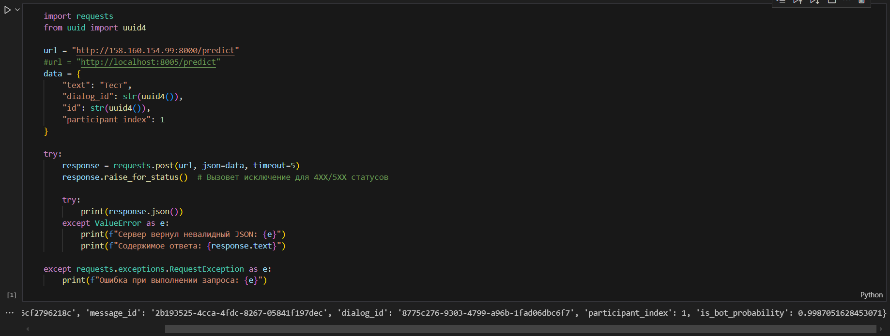

# Что это?
Сервис для прохождения теста Тьюринга с готовым ландшафтом для поддержки, деплоя и обслуживания.
На вход сервису подается текстовое сообщение, на выходе вероятность, что сообщение от бота.
# Quickstart   
Для активации виртульного окружения:  
```poetry shell```  

Для установки необходимых библиотек:  
```poetry install```  

Для подъема контейнеров:  
```docker-compose up -d```  

Презентация проекта лежит в ProductionML.pdf  
.png>)

# Пример взаимодействия с сервисом:  



# Комментарии для работы с различными сервисами

## LabelStudio

1) все взаимодействие через веббраузер:
http://localhost:5433/ - labelstudio
http://localhost:9003 - бд minio

2) команды для открытия портов  
```
sudo ufw allow 9002/tcp
sudo ufw allow 9003/tcp
sudo ufw allow 5051/tcp
```

## MLflow
0) Копирование данных 
```aws s3 cp s3://dialog-annotations /home/georgii-tebelev/g.tebelev/HW5 -MLFlow```

1) в папке HW5-MLflow - 3 сервиса: mlflow, postgres, minio
```docker-compose up -d```
2) все взаимодействие через веббраузер:
http://localhost:5050/ - mlflow admin/your_password
http://127.0.0.1:50187/ - бд minio minio_user/minio_pass

3) Создание бакета:
```mc alias set myminio http://localhost:9000 minio_user minio_pass```
```mc mb myminio/mlflow```

4) Закачка данных:
```poetry run python -m prepare_data```

5) Обучение:
```poetry run python -m train```

6) Инференс полученной модели в папке tests
```poetry run python -m test_champion_model```  
если все ок:  
1: О, круто. Я Артем. А ты тут чего делаешь?  
is_bot_probability: 0.0002926163813620921  
0: опенэйаю  
is_bot_probability: 0.0017449284646594253  


## DVC pipeline
1) В этой домашке нужно было создать множество py файлов: 
* dataset.py, где происходит подкачка сырых диалогов
* train_test_split.py, где происходит разбиение на трейн и тест
* train.py, тут происходит тренировка модели
* evaluate.py, а тут измерение
в этом дз, тренироваться должна модель из MLFlow 5 дз, но мы дружно забили и там другая модель

2) запуск dvc пайплайна:
```dvc repro```
результаты выкачки из s3 помещаются в data/raw_data, обработанные данные в data/preprocessed_data
модель отправляется в models/, результаты измерений в metrics

3) Также в этом ДЗ настраивал линтеры для проверки кода, запуск линтеров:
```ruff format --check``` - выводит все замечания.
```ruff check``` - если все ок, то она выведет **All checks passed!**


# HW9 LLM 
1) Тут распишу,как поднимать llm через докер и делать запрос 

Поднять сервис с llm d в папке HW9-LLM:  
```docker-compose up -d```

Дождаться пока все поднимется и отправить запрос
```
curl http://localhost:38300/v1/chat/completions \
 -H "Authorization: Bearer cu_prodml_hw_week9" \
 -H "Content-Type: application/json" \
 -d '{
 "model": "model_identifier",
"messages": [{"role":"user","content":"Hello!"}]
 }'
```

2) По идее эта модель должна генерировать сообщения для классификации и работать вместо дефолтного shooter'a из первых ДЗ


# AIRFLOW
1) Перед запуском поменять переменные
```
export AIRFLOW__WEBSERVER__WEB_SERVER_PORT=9660
export AIRFLOW_HOME=/home/georgii-tebelev/g.tebelev/HW11-Airflow/airflow
export AIRFLOW__CORE__DAGS_FOLDER=/home/georgii-tebelev/g.tebelev/HW11-Airflow/airflow/dags
```
2) Погасить старые процессы про портах 9660 8794 8793
```
sudo lsof -i :9660 8794 8793
sudo kill -9  705046
```

3) Запустить airflow  
```airflow standalone```
в фоновом режиме:
```nohup airflow standalone > airflow.log 2>&1 &```


# Developing and Administration Intro


Run service:

```bash
poetry run python -m uvicorn turing_test_service.api.main:app --log-config=./config/logging_config.yaml
```

Run client example: 

```bash
cd tools/client_example
python3 -m venv venv
source ./venv/bin/activate
pip install -r requirements.txt
python -m main
```

Quick start: 

1. Команды для установки зависимостей:  
```poetry shell```  
```poetry install```

2. Настройка DVC  
```dvc repro -f```  
3. Запуск сервисов в docker compose  
```docker compose up``` в папке labelstudio или в корне
4. Запуск тестов
```pytest --cov=. --cov-report=term-missing``` -оценить покрытие тестами
